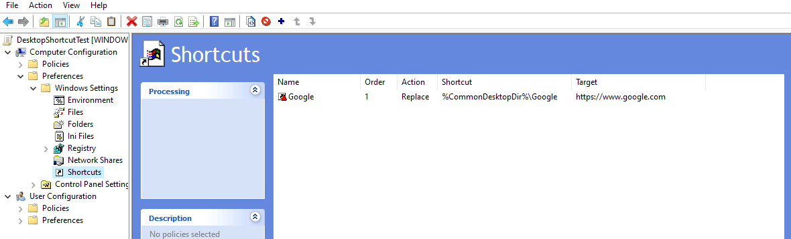

# Azure Active Directory Lab Setup

This project guides you through setting up an Azure Active Directory lab environment using the Azure Portal, including a Domain Controller and a Client VM connected to a custom domain (`lab.local`). The setup uses Azure resources to create a virtual network, VMs, and Bastion for secure connectivity.

---

## Prerequisites
- An active Azure subscription
- Access to the [Azure Portal](https://portal.azure.com)
- Basic knowledge of Azure, Active Directory, and Windows Server administration

---

## Part 1: Setting Up the Environment

### 1. Create Resource Group
*Create a resource group to organize all resources for the lab.*

In the Azure Portal, navigate to **Resource Groups > Create**.

<br><br>


_Optional Group Tags_

Enter:  
Resource group: `ADLabResourceGroup`  
Region: Select a region (e.g., East US).  
Click **Review + Create**, then **Create**.

### 2. Create Virtual Network (VNet)
*Set up a VNet to host the VMs.*

In the Azure Portal, go to **Virtual Networks > Create**.

Enter:  
Resource group: `ADLabResourceGroup`  
Name: `ADLabVNet`  
Region: Same as resource group (e.g., East US).

Under IP Addresses, set:  
IPv4 address space: `10.0.0.0/16`  
Subnet name: `ADLabSubnet`  
Subnet address range: `10.0.1.0/24`  

Click **Review + Create**, then **Create**.

<br><br>


### 3. Create Domain Controller VM
Deploy a VM running Windows Server 2022 to act as the Domain Controller.

In the Azure Portal, go to **Virtual Machines > Create > Azure virtual machine**.

Enter:  
Resource group: `ADLabResourceGroup`  
Virtual machine name: `DC-VM`  
Region: Same as resource group.  
Image: `Windows Server 2022 Datacenter`  
Size: `Standard_D2s_v3` (or adjust based on needs. B2s work well for lab environments).  

Administrator account:  
Username: `AzureAdmin`  
Password: Set a strong password

Networking:  
Virtual network: `ADLabVNet`  
Subnet: `ADLabSubnet`

Click **Review + Create**, then **Create**.

Note the private IP address of the VM (e.g., `10.0.1.4`) after deployment.

<br><br>

<br><br>


### 4. Connect with Azure Bastion
*Set up Azure Bastion for secure RDP access to the VMs.*

In the Azure Portal, go to **Bastion > Create**.

Enter:  
Resource group: `ADLabResourceGroup`  
Bastion name: `ADLabBastion`  
Region: Same as resource group.  
Virtual network: `ADLabVNet`  
Subnet: Create a new subnet named `AzureBastionSubnet` with address range `10.0.2.0/24`.  
Public IP address: Create a new IP named `BastionIP`.

Click **Review + Create**, then **Create**.

To connect:  
Go to **Virtual Machines > Select DC-VM > Connect > Bastion**.  
Enter the VM’s admin credentials and connect via RDP.  

ℹ️ Bastion avoids assigning public IPs to VMs, reducing exposure compared to direct RDP.
Note that you are charged for every hour the Bastion is active, regardless of whether you are
running the VM.


### 5. Create Client VM
*Deploy a second VM (Client) on the same VNet.*

In the Azure Portal, go to **Virtual Machines > Create > Azure virtual machine**.

Enter:  
Resource group: `ADLabResourceGroup`  
Virtual machine name: `Client-VM`  
Region: Same as resource group.  
Image: `Windows Server 2022 Datacenter` (or Windows 10/11 Enterprise).  
Size: `Standard_D2s_v3` (or adjust based on needs).  

Administrator account:  
Username: `azureadmin`  
Password: Set a strong password  

Networking:  
Virtual network: `ADLabVNet`  
Subnet: `ADLabSubnet`  

Click **Review + Create**, then **Create**.

---

## Part 2: Connecting to Active Directory

### 6. Install Active Directory Domain Services
*Promote the Domain Controller VM to a Domain Controller for `lab.local`.*

1. Connect to DC-VM using Bastion (See Step 4).
2. Open **Server Manager > Add Roles and Features**.
3. Select **Role-based or feature-based installation**, then select DC-VM.
4. Check **Active Directory Domain Services** and complete the installation.
5. After installation, click the notification flag in Server Manager and select **Promote this server to a domain controller**.
6. Choose **Add a new forest**, set:  
   Root domain name: `lab.local`
7. Configure options (e.g., DNS, DSRM password), and complete the promotion process.
8. The VM will restart.

<br><br>

<br><br>


### 7. Connect Client VM to the Domain
1. Join the Client VM to the `lab.local` domain.
2. Connect to Client-VM using Bastion.
3. Set the DNS server to the Domain Controller’s private IP address:
   - Open Control Panel > Network and Sharing Center > Change adapter settings.
   - Right-click the network adapter > Properties > Select Internet Protocol Version 4 (TCP/IPv4) > Properties.
   - Set **Preferred DNS server** to the DC-VM’s private IP (e.g., `10.0.1.4`).
4. Join the domain:
   - Go to Control Panel > System and Security > System > Change settings > Change.
   - Select **Domain** and enter `lab.local`.
   - Provide domain admin credentials (e.g., `lab.local\azureadmin`).
5. Restart the Client VM to apply changes.


### 8. Verification
1. Log in to the Client VM with a domain account (e.g., `lab.local\azureadmin`).
2. Open a Command Prompt and run:
   ```cmd
   nltest /dsgetdc:lab.local
   ```
   Verify the output shows the Domain Controller details.
3. Optionally, run:
   ```cmd
   echo %logonserver%
   ```
   to confirm the domain controller used for logon.

---

## Part 3: Exploring Active Directory

### 9. Add & Test Domain Users
1. On DC-VM → open **Active Directory Users and Computers** (`dsa.msc`).
2. Right-click **Users** or create a new OU (e.g., `ITDept`) → **New > User**.
3. Give them a simple password and uncheck “User must change password at next logon” for testing.
4. On the Client-VM → log out → log in as that domain user (`LAB\\username`).

<br><br>

<br><br>


### 10. Create Organizational Units (OUs)
1. In ADUC → Right-click your domain (`lab.local`) → **New > Organizational Unit**.
2. Example: HR, IT, Servers.
3. Move users and the client computer into the appropriate OU.

<br><br>

<br><br>

<br><br>


### 11. Apply a Group Policy Object (GPO)
1. On DC-VM → open **Group Policy Management** (`gpmc.msc`).
2. Right-click your domain or OU → **Create a GPO** → Name: `DesktopShortcutTest`.
3. Edit it → Example:  
   ```
   Computer Configuration → Preferences → Windows Settings → Shortcuts
   ```
   Link the GPO to the OU with the client in it.  
4. On Client-VM, run:  
   ```cmd
   gpupdate /force
   ```
5. Verify the shortcut is added in real time.

<br><br>


---

## Part 4: Final Thoughts

### Cleanup
- To avoid incurring costs, delete the resource group when done:  
  In the Azure Portal, go to **Resource Groups > Select ADLabResourceGroup > Delete resource group**.  
- Alternatively, deallocate the VMs to save costs but keep them for later use.  
- Confirm by typing the resource group name and clicking **Delete**.

### Notes
- Ensure both VMs are in the same VNet (`ADLabVNet`) and subnet (`ADLabSubnet`) for proper communication. (Very important!)  
- Bastion provides secure access; avoid exposing VMs to public IPs.  
- For production environments, configure additional security measures (e.g., Network Security Groups, backups).

### Considerations for Future Projects
- Policy updates are simpler when applied at the computer level versus individual users.  
- Work toward deploying desktop backgrounds for users.  
- Automate common AD tasks as you grow familiar with the environment.  
- Explore enabling **Azure Update Manager** policies.
